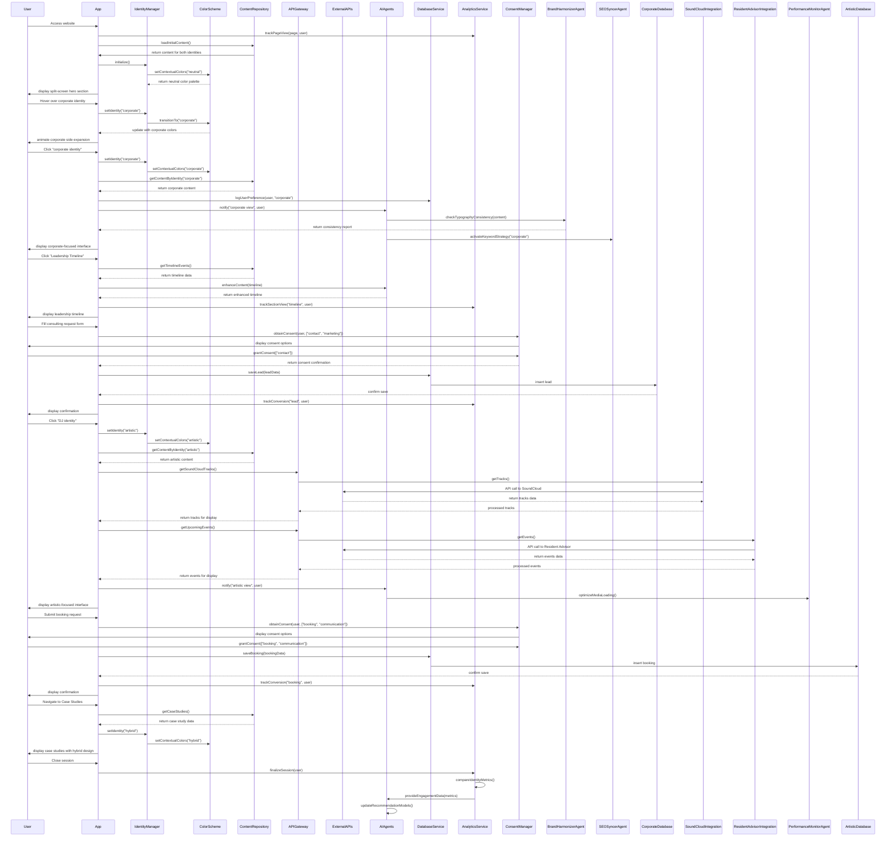

# Dual-Identity Platform System Design

## Implementation approach

Based on the PRD requirements, we will implement a modern web application that effectively showcases both corporate and artistic identities with seamless transitions between them. Here's our approach to the key technical challenges:

### 1. Dynamic Content Management

We'll use a headless CMS (Contentful) as the backend for content management, allowing for flexible content structures for both identities while maintaining a unified frontend experience. This separation of concerns will enable content creators to update either identity's content independently.

### 2. Responsive Split-Screen Design

We'll implement the split-screen functionality using React with Next.js for server-side rendering. The hero section will leverage CSS Grid and Flexbox for responsive layouts, with Framer Motion handling smooth animations between states.

### 3. Adaptive Color System

We'll create a dynamic theming system using Tailwind CSS with custom configuration that allows contextual color shifting. The system will detect which identity section the user is currently viewing and smoothly transition the color palette accordingly.

### 4. AI-Powered Features

We'll build a multi-agent AI system using a microservices architecture. Each specialized agent (Brand Harmonizer, SEO Syncer, Performance Monitor) will operate independently, communicating through a message broker for coordination.

### 5. Third-Party API Integration

We'll implement a unified API gateway pattern to handle all external service integrations (SoundCloud, Resident Advisor, Calendly, Beatport) with appropriate caching strategies and error handling.

### 6. GDPR-Compliant Data Management

We'll use a segmented database approach with separate collections for corporate and artistic data, implementing comprehensive consent management and encryption for all personal data.

### Framework Selection

- **Frontend**: React with Next.js for SSR, SEO benefits, and routing capabilities
- **Styling**: Tailwind CSS with custom configuration for the adaptive color system
- **Animation**: Framer Motion for smooth transitions between identity contexts
- **CMS**: Contentful for headless content management
- **Database**: MongoDB for flexible schema design across different content types
- **API Management**: Express.js for the API gateway with Redis for caching
- **AI Integration**: Custom agents built on TensorFlow.js and OpenAI API
- **Analytics**: Google Analytics 4 with custom event tracking
- **Authentication**: Auth0 for secure user authentication and authorization

## Data structures and interfaces

The following class diagram outlines the core components and their relationships in the dual-identity platform:

```mermaid
classDiagram
    class User {
        +string id
        +string email
        +string[] preferences
        +boolean consentGiven
        +Date consentTimestamp
        +getPreferredIdentity() string
        +updateConsent(boolean consent) void
        +updatePreferences(string[] prefs) void
    }
    
    class IdentityManager {
        +string activeIdentity
        +toggleIdentity() void
        +setIdentity(string identity) void
        +getActiveIdentity() string
        +getColorScheme() ColorScheme
    }
    
    class ColorScheme {
        +string[] corporatePalette
        +string[] artisticPalette
        +object currentPalette
        +setContextualColors(string identity) void
        +getColor(string colorName) string
        +transitionTo(string identity) void
    }
    
    class ContentRepository {
        +getContentByIdentity(string identity) Content[]
        +getCaseStudies() CaseStudy[]
        +getTimelineEvents() Event[]
        +getTestimonials() Testimonial[]
    }
    
    class Content {
        +string id
        +string title
        +string description
        +string identity
        +string[] tags
        +Date createdAt
        +Date updatedAt
        +getMediaAssets() MediaAsset[]
    }
    
    class CorporateContent {
        +string position
        +string company
        +string[] expertise
        +getConsultancyServices() Service[]
        +getLeadershipEvents() Event[]
    }
    
    class ArtisticContent {
        +string djName
        +string[] genres
        +string[] venues
        +getUpcomingEvents() Event[]
        +getTracks() Track[]
        +getMixes() Mix[]
    }
    
    class CaseStudy {
        +string id
        +string title
        +string description
        +string[] tags
        +object metrics
        +string[] identities
        +getRelatedContent() Content[]
    }
    
    class AIAgent {
        +string id
        +string type
        +object configuration
        +process(object data) object
        +train(object data) void
        +evaluate() object
    }
    
    class BrandHarmonizerAgent {
        +checkTypographyConsistency(string content) object
        +suggestVisualAdjustments(object content) object
        +monitorBrandConsistency() Report
    }
    
    class SEOSyncerAgent {
        +generateKeywordStrategy(string identity) string[]
        +analyzeContentSEO(Content content) Report
        +generateSchemaMarkup(Content content) string
    }
    
    class PerformanceMonitorAgent {
        +monitorLoadTimes() Metrics
        +optimizeImages(MediaAsset[] assets) MediaAsset[]
        +suggestCDNOptimizations() Suggestions
    }
    
    class APIGateway {
        +integrateExternalAPI(string service) Promise
        +cacheResponse(string key, object data) void
        +handleError(Error error) Response
    }
    
    class SoundCloudIntegration {
        +getTracks() Track[]
        +getPlaylists() Playlist[]
        +embedPlayer(string trackId) HTMLElement
    }
    
    class ResidentAdvisorIntegration {
        +getEvents() Event[]
        +getVenueInfo(string venueId) Venue
        +syncCalendar() boolean
    }
    
    class CalendlyIntegration {
        +getAvailability() TimeSlot[]
        +bookAppointment(string timeSlot, User user) Appointment
        +cancelAppointment(string appointmentId) boolean
    }
    
    class BeatportIntegration {
        +getReleases() Track[]
        +getChartPosition(string trackId) number
        +purchaseLink(string trackId) URL
    }
    
    class DatabaseService {
        +connect() void
        +disconnect() void
        +query(object filter) Promise
        +insert(object data) Promise
        +update(string id, object data) Promise
        +delete(string id) Promise
    }
    
    class CorporateDatabase {
        +getLeads() Lead[]
        +getConsultancyRequests() Request[]
        +getCourseEnrollments() Enrollment[]
        +saveLead(Lead lead) string
    }
    
    class ArtisticDatabase {
        +getBookings() Booking[]
        +getFeedback() Feedback[]
        +getTrackAnalytics() Analytics
        +saveBookingRequest(Booking booking) string
    }
    
    class ConsentManager {
        +obtainConsent(User user, string[] purposes) Consent
        +verifyConsent(User user, string purpose) boolean
        +revokeConsent(User user, string purpose) void
        +exportUserData(string userId) UserData
        +deleteUserData(string userId) boolean
    }
    
    class AnalyticsService {
        +trackPageView(string page, User user) void
        +trackConversion(string goal, User user) void
        +generateReport(string reportType) Report
        +compareIdentityMetrics() Comparison
    }
    
    Content <|-- CorporateContent
    Content <|-- ArtisticContent
    AIAgent <|-- BrandHarmonizerAgent
    AIAgent <|-- SEOSyncerAgent
    AIAgent <|-- PerformanceMonitorAgent
    APIGateway -- SoundCloudIntegration
    APIGateway -- ResidentAdvisorIntegration
    APIGateway -- CalendlyIntegration
    APIGateway -- BeatportIntegration
    DatabaseService <|-- CorporateDatabase
    DatabaseService <|-- ArtisticDatabase
    IdentityManager -- ColorScheme
    ContentRepository -- Content
    ContentRepository -- CaseStudy
    User -- IdentityManager
    User -- ConsentManager
    AnalyticsService -- User
```

## Program call flow

The following sequence diagram illustrates the main interaction flows in the dual-identity platform:

## Anything UNCLEAR

1. **CMS Selection Confirmation**: The PRD mentions a headless CMS approach but doesn't specify a preferred platform. We've selected Contentful but this should be confirmed before implementation begins.

2. **Multi-language Implementation**: The PRD mentions Spanish/English support as P1 requirement, but doesn't detail the content translation workflow. Will translations be managed manually through the CMS, or is an automated translation service preferred?

3. **AI Model Training**: The PRD specifies AI agents but doesn't provide details on the initial training data. Will historical data be available for training the AI agents, or will they learn from scratch after deployment?

4. **Mobile Experience Prioritization**: While the PRD includes mobile layouts, it's unclear if mobile optimization should have equal priority to desktop during implementation phases.

5. **Performance Targets**: Specific performance metrics (load time targets, animation frame rates, etc.) haven't been quantified in the PRD.

6. **Analytics Implementation Details**: While dual-track analytics are mentioned, specific event tracking requirements and conversion goals need further definition.

7. **Data Retention Policies**: GDPR compliance is specified, but specific data retention periods for different data categories aren't defined.

8. **Fallback Strategies**: Approaches for handling external API failures (SoundCloud, Resident Advisor) aren't specified.