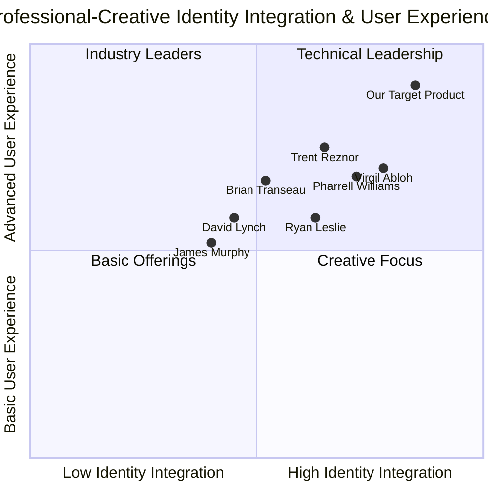

# Product Requirements Document: Dual-Identity Professional Portfolio Platform

*Document Date: May 30, 2025*

## Original Requirements

Create a dual-identity website showcasing both a corporate identity (Aston School Barcelona CEO) and an artistic identity (DJ alias 'Sometimes DJ') with a split-screen layout. The website should feature:

1. Dynamic hero section with left panel for corporate identity and right panel for artistic identity with smooth transition animations
2. Adaptive color scheme merging corporate professionalism with electronic music energy
3. Corporate Profile Section with leadership timeline and consultancy portal
4. Music Career Section with live performance hub and production portfolio
5. Aston School Microsite with course dashboard
6. Converged Brand Strategy with case study library
7. Various technical implementations including AI-optimized backend, GDPR compliance, and analytics tracking

## 1. Product Definition

### 1.1 Product Goals

1. Create a visually striking dual-identity platform that seamlessly integrates professional corporate presence with artistic DJ persona while maintaining distinct brand identities
2. Establish an intuitive user experience that allows visitors to effortlessly navigate between corporate and artistic content domains without confusion
3. Implement advanced AI-driven functionality to enhance content relevance, personalization, and performance optimization across both identity contexts

### 1.2 User Stories

1. As a potential corporate client, I want to quickly access the Aston School Barcelona credentials and services without being distracted by DJ content, so that I can evaluate professional qualifications efficiently.
2. As a music event organizer, I want to explore the DJ portfolio, listen to mixes, and understand booking requirements, so that I can determine if 'Sometimes DJ' fits my event needs.
3. As a student interested in Aston School courses, I want to easily navigate the educational offerings and sign up for courses, so that I can start learning without confusion from other site content.
4. As an industry professional interested in the convergence of corporate and creative sectors, I want to see case studies demonstrating how marketing expertise enhances music promotion, so that I can understand the unique value proposition.
5. As a return visitor, I want the site to remember my previous area of interest (corporate or music), so that I can continue engaging with relevant content without repetitive navigation.

### 1.3 Competitive Analysis

#### Corporate-Artistic Dual-Identity Websites

1. **Ryan Leslie (Entrepreneur/Musician)**
   - Pros: Clean transition between business ventures and music career, integrated e-commerce platform
   - Cons: Limited interactive elements, no dynamic content shifting

2. **Virgil Abloh (Designer/DJ)**
   - Pros: Strong visual cohesion between fashion and music identities, portfolio-centric design
   - Cons: Limited educational content integration, complex navigation system

3. **Brian Transeau (BT) (Composer/Technologist)**
   - Pros: Excellent media integration, smooth transitions between artistic and technical content
   - Cons: Dense information architecture, limited mobile optimization

4. **David Lynch (Filmmaker/Musician)**
   - Pros: Distinctive visual style that spans both identities, immersive media experiences
   - Cons: Limited business functionality, minimal lead generation features

5. **Trent Reznor (Musician/Composer/Sound Designer)**
   - Pros: Seamless project transitions, excellent portfolio organization
   - Cons: Limited B2B service offerings, minimal educational content

6. **James Murphy (LCD Soundsystem/Wine Bar Owner)**
   - Pros: Strong lifestyle brand integration, effective content categorization
   - Cons: Limited business service descriptions, inconsistent UX patterns

7. **Pharrell Williams (Producer/Fashion Designer)**
   - Pros: Strong visual branding, effective cross-promotion between ventures
   - Cons: Complex information hierarchy, limited personalization features

### 1.4 Competitive Quadrant Chart



## 2. Technical Specifications

### 2.1 Requirements Analysis

The dual-identity professional portfolio platform requires sophisticated technical implementation to achieve seamless integration between corporate and artistic personas while maintaining distinct visual branding for each. Key technical challenges include:

1. **Dynamic Content Management**: Implementing a system that manages and presents two distinct content domains while maintaining overall site cohesion

2. **Responsive Split-Screen Design**: Creating a visually impressive yet functionally efficient split-screen layout that adapts to various devices and screen sizes

3. **Adaptive Color Systems**: Developing a color scheme framework that dynamically shifts based on content context while maintaining overall brand consistency

4. **Interactive Transitions**: Building smooth, performant animations for identity transitions without sacrificing page load speed or accessibility

5. **Multi-Agent AI Integration**: Implementing specialized AI agents for content optimization, personalization, and performance monitoring

6. **Integrated Third-Party Services**: Connecting multiple external APIs (Resident Advisor, SoundCloud, Calendly, etc.) while maintaining performance and security

7. **Dual Analytics Framework**: Creating an analytics system that effectively tracks and differentiates between corporate and artistic engagement metrics

8. **GDPR-Compliant Data Management**: Implementing segmented data collection with proper consent management and storage practices

### 2.2 Requirements Pool

#### P0 (Must-Have Requirements)

1. Dual-identity hero section with dynamic split-screen functionality and smooth transition animations
2. Adaptive color scheme that contextually shifts between corporate and artistic content areas
3. Responsive design that maintains dual-identity functionality across desktop and mobile devices
4. Corporate profile section with interactive leadership timeline
5. Music career section with embedded SoundCloud player and event calendar
6. GDPR-compliant contact forms with segmented data collection
7. Basic analytics tracking for both corporate and artistic content areas
8. SEO optimization for both professional and artistic identities
9. Aston School course information and basic signup functionality
10. Case study showcase demonstrating crossover between marketing expertise and music promotion

#### P1 (Should-Have Requirements)

1. AI-driven brand consistency monitoring across dual identities
2. Consultancy portal with Calendly API integration for appointment scheduling
3. Live performance hub with Resident Advisor API integration
4. User preference storage to remember content preference (corporate/music)
5. Automated testimonial integration in leadership timeline
6. Multi-language support (Spanish/English) throughout the platform
7. Enhanced analytics dashboard with conversion tracking for both identities
8. Production portfolio with track breakdown features
9. Password-protected student portal for Aston School courses
10. Dynamic rider request forms for DJ booking inquiries

#### P2 (Nice-to-Have Requirements)

1. AI-powered personalized content recommendations based on browsing patterns
2. Interactive webinar platform for "Boardroom to Booth" series
3. Collaboration portal for brand partnership submissions
4. Advanced A/B testing framework for identity presentation
5. AI-generated content for blog posts spanning both domains
6. Virtual DJ experience with interactive mixer interface
7. Automated email marketing workflows based on identity interest
8. Voice-activated navigation between corporate and artistic sections
9. Augmented reality portfolio presentations
10. Real-time social media content aggregation across both identities

### 2.3 UI Design Draft

#### Hero Section (Split-Screen Layout)

```
┌─────────────────────┬─────────────────────┐
│                     │                     │
│    CORPORATE        │    ARTISTIC         │
│    IDENTITY         │    IDENTITY         │
│                     │                     │
│  ┌─────────────┐    │    ┌─────────────┐  │
│  │ Professional│    │    │  DJ         │  │
│  │ Headshot    │    │    │  Photo      │  │
│  └─────────────┘    │    └─────────────┘  │
│                     │                     │
│  Aston School       │  Sometimes DJ       │
│  Barcelona CEO      │                     │
│                     │                     │
│  [Learn More]       │  [Listen Now]       │
│                     │                     │
└─────────────────────┴─────────────────────┘
```

#### Navigation Structure

```
┌─────────────────────────────────────────────┐
│  Logo                             Menu ≡    │
├─────────────────────────────────────────────┤
│                                             │
│  ┌─────────┐ ┌─────────┐ ┌─────────────┐   │
│  │Corporate│ │DJ Career│ │Aston School│   │
│  └─────────┘ └─────────┘ └─────────────┘   │
│                                             │
│  ┌───────────────┐ ┌───────────────────┐   │
│  │Case Studies   │ │Contact/Book       │   │
│  └───────────────┘ └───────────────────┘   │
│                                             │
└─────────────────────────────────────────────┘
```

#### Mobile Layout Transformation

```
┌─────────────────────┐
│  Logo        Menu ≡ │
├─────────────────────┤
│                     │
│    TOGGLE IDENTITY  │
│   ◉ Corporate       │
│   ○ Artistic        │
│                     │
│  ┌─────────────┐    │
│  │ Professional│    │
│  │ Headshot    │    │
│  └─────────────┘    │
│                     │
│  Aston School       │
│  Barcelona CEO      │
│                     │
│  [Learn More]       │
│                     │
└─────────────────────┘
```

### 2.4 Open Questions

1. **Content Management Integration**: What is the preferred CMS platform for managing dual-identity content? Is a headless CMS approach preferred?

2. **Performance Baseline Requirements**: What are the specific performance targets for page load times across different regions, particularly for media-heavy sections?

3. **Identity Balance Preference**: Should the default presentation favor corporate or artistic identity, or should they have equal visual weight?

4. **Data Privacy Requirements**: Beyond GDPR compliance, are there additional data privacy frameworks or regional requirements that must be addressed?

5. **Content Update Frequency**: How frequently will content be updated across both identity sections? Will this require advanced scheduling capabilities?

6. **Multilingual Requirements**: Beyond Spanish/English, are additional languages required for global audience reach?

7. **Integration Priority**: Which third-party integrations (Calendly, SoundCloud, Resident Advisor) should be prioritized in the development timeline?

8. **AI Agent Specificity**: What are the key performance indicators that AI agents should optimize for across different sections of the platform?

## 3. Implementation Recommendations

### 3.1 Technology Stack Recommendations

- **Frontend**: React with Next.js for server-side rendering and improved SEO performance
- **Styling**: Tailwind CSS for adaptive design system implementation
- **Animation**: Framer Motion for smooth transitions between identity contexts
- **CMS**: Headless CMS (Contentful or Sanity) for flexible content management across identity domains
- **AI Integration**: Custom multi-agent system built on large language models with specialized agents for different optimization tasks
- **Analytics**: Google Analytics 4 with custom event tracking and dual conversion paths
- **APIs**: RESTful architecture for third-party integrations with caching for performance
- **Database**: MongoDB for flexible schema management across different content types

### 3.2 Development Approach

1. **Component-Based Architecture**: Develop reusable components that can adapt to either corporate or artistic context through props
2. **Design System First**: Establish comprehensive design system with adaptive color palettes before component development
3. **Progressive Enhancement**: Build core functionality first, then layer in advanced features and animations
4. **Continuous User Testing**: Implement regular testing cycles to validate dual-identity UX effectiveness
5. **Mobile-First Approach**: Design for mobile experiences first, then expand to larger screen layouts

### 3.3 AI Implementation Strategy

Implement a multi-agent AI system with specialized components:

1. **Brand Harmonizer Agent**: Monitors typography consistency and visual coherence across sections
2. **SEO Syncer Agent**: Generates dual keyword strategies for both corporate and artistic content
3. **Performance Monitor Agent**: Continuously optimizes image loading and resource allocation
4. **Content Recommendation Agent**: Personalizes user journeys based on interaction patterns
5. **Analytics Interpreter Agent**: Provides actionable insights from dual-conversion tracking

### 3.4 Performance Optimization Strategy

1. **Lazy Loading**: Implement progressive loading for media-heavy DJ content sections
2. **Code Splitting**: Separate bundles for corporate and artistic sections to minimize initial load
3. **Image Optimization Pipeline**: Automated processing for performance across both visual domains
4. **Edge Caching**: Implement CDN caching strategies optimized for global audience
5. **Performance Budget**: Establish and maintain strict performance metrics for both sections

## 4. Success Metrics

### 4.1 User Engagement Metrics

- **Dual Conversion Rate**: Percentage of visitors engaging with both corporate and artistic content
- **Section Retention**: Time spent in each identity section before switching or leaving
- **Return Visitor Identity Preference**: Tracking returning visitors' consistent preference for either identity
- **Cross-Section Journey Completion**: Completion rate of user flows that span both identities
- **Mobile vs. Desktop Engagement Ratio**: Comparison of engagement patterns across devices

### 4.2 Business Impact Metrics

- **Corporate Lead Generation**: Quantity and quality of business inquiries through corporate sections
- **DJ Booking Inquiries**: Volume and conversion rate of performance booking requests
- **Course Enrollments**: Number of Aston School course registrations from the platform
- **Case Study Engagement**: Time spent and interaction with convergence case studies
- **Geographic Lead Distribution**: Analysis of lead sources by region for both identities

### 4.3 Technical Performance Metrics

- **Load Time by Section**: Performance benchmarks for each identity section
- **Animation Performance**: Frame rate and smoothness metrics for identity transitions
- **AI Recommendation Relevance**: Accuracy of content recommendations across identities
- **SEO Performance**: Ranking improvements for both corporate and artistic keywords
- **Accessibility Compliance**: WCAG compliance scores across all sections

## 5. Timeline and Phased Implementation

### 5.1 Phase 1: Foundation (Months 1-2)
- Requirements finalization and design system creation
- Core dual-identity architecture implementation
- Basic responsive split-screen hero section
- Essential corporate and DJ content sections

### 5.2 Phase 2: Core Functionality (Months 3-4)
- Interactive transitions between identity sections
- Integration of media players and calendars
- Implementation of contact forms and lead generation
- Aston School course information and signup flows

### 5.3 Phase 3: Advanced Features (Months 5-6)
- AI agent system integration for content optimization
- Analytics system implementation with dual conversion tracking
- Third-party API integrations (Resident Advisor, Calendly)
- Case study library with interactive elements

### 5.4 Phase 4: Optimization and Enhancement (Month 7)
- Performance optimization across devices and regions
- A/B testing framework implementation
- Content personalization based on browsing patterns
- Final accessibility and compliance review

## 6. Conclusion

The Dual-Identity Professional Portfolio Platform represents an innovative approach to personal branding that effectively bridges professional corporate identity with artistic expression. By implementing a sophisticated split-screen design with adaptive color schemes and AI-enhanced functionality, the platform will provide a seamless yet distinctive experience for different audience segments.

This PRD outlines the core requirements, technical specifications, and implementation strategy to create a standout platform that showcases both the Aston School Barcelona CEO identity and the "Sometimes DJ" persona while maintaining brand cohesion and providing intuitive user experiences.

By prioritizing requirements and implementing in phases, the development team can focus on delivering core functionality first while progressively enhancing the platform with advanced features. The defined success metrics will guide ongoing optimization to ensure the platform achieves its dual-identity business objectives.